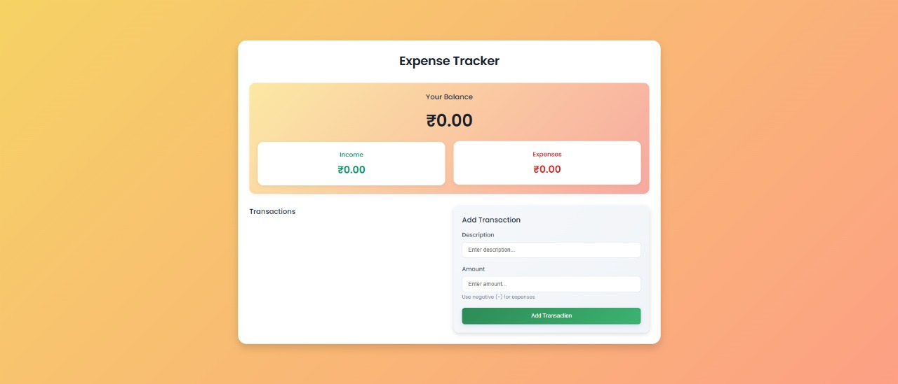

# 💰 Expense Tracker

A simple web-based Expense Tracker built using **HTML**, **CSS**, and **JavaScript**.  
Track your income and expenses with a clean, responsive UI and real-time updates using `localStorage`.

---

## ✨ Features

- Add and delete transactions (income or expense)
- Real-time balance updates
- Visual summary of income and expenses
- Saves data using browser localStorage (persists on reload)
- Responsive design (mobile-friendly)

---

## 🛠️ Built With

- HTML5
- CSS3 (custom design with gradients and transitions)
- Vanilla JavaScript (no frameworks)

---

## 📸 Preview

---

## 🚀 Getting Started

1. Clone the repo  
   ```bash
   git clone https://github.com/Vidhi-Verma/Expense-Tracker.git

## 📂 Folder Structure
Expense-Tracker/
├── index.html
├── style.css
├── script.js
├── README.md
└── screenshot.png   ✅


